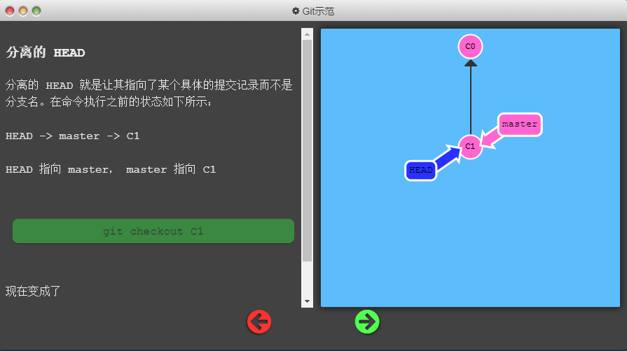
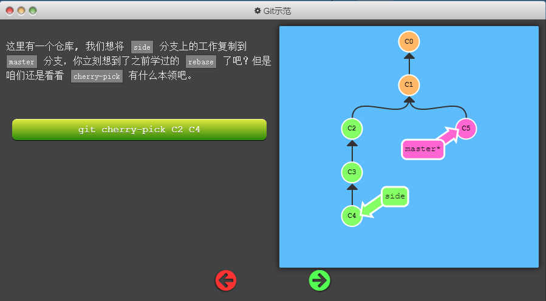

# Git与GitHub的学习笔记-实验楼

## 一、来历等无关紧要的东西

* Linus想要版本控制软件然后就改进了BitKeeper
* 2005年BitKeeper要收回版权，Linus就花10天写了Git
* 2007年三个年轻人觉得Git是个好东西，就搞了个GitHub

## 二、在GitHub上创建仓库

* 创建仓库

  > 

* 注意 （忽略文件、选择所属协议）

  > 
  >
  > 这两项作用之后再讲
  
* Github issue

  > 发现bug，但是目前没有成型代码，需要讨论用，算不算提单？close issue 双方都可以关

* Pull Request

  > fork项目
  >
  > 修改自己仓库的代码
  >
  > 新建pull request
  >
  > 等待作者操作/检查、merge

## 三、安装、升级Git

* git版本查看

  ```shell
  git --version
  ```

* Linux下升级

  ```shell
  sudo apt update  # 更新源
  sudo apt install software-properties-common # 安装 PPA 需要的依赖
  sudo add-apt-repository ppa:git-core/ppa    # 向 PPA 中添加 git 的软件源
  ```

  > linux下升级可能会出错，这时候可能是Python版本问题，可以选择Python3.4：
  >
  > ```shell
  > sudo apt update  # 更新源
  > sudo apt install software-properties-common # 安装 PPA 需要的依赖
  > sudo add-apt-repository ppa:git-core/ppa    # 向 PPA 中添加 git 的软件源
  > ```

  > Windows下安装就直接去官网下载安装好了

## 四、克隆GitHub上的仓库到本地

### 4.1 git clone

* 得到仓库地址：地址栏中复制或者选择Clone or download

  >

* 克隆到本地 git clone

  > 先在到你希望下载到的文件夹中，gitbash here
  >
  > git clone [url]

#### //还有一些其他指令如 -b 之后补充

### 4.2 .git隐藏目录

进入仓库主目录，如下图所示，仓库主目录中有个 `.git` 隐藏目录，它里面包含了仓库的全部信息，**删掉这个目录，仓库就变成普通的目录了**。进入到仓库目录中，命令行前缀发生了一些变化，出现了红色（win是蓝绿色）的 master ，它就是当前所在的分支名：

> 

### 4.3 远程仓信息 git remote -v

克隆一个 GitHub 仓库（也叫远程仓库）到本地，本地仓库则会自动关联到这个远程仓库，执行 `git remote -v` 命令可以**查看本地仓库所关联的远程仓库信息：**

> 

Git 要求对本地仓库关联的每个远程主机都必须指定一个主机名（默认为 origin），用于本地仓库识别自己关联的主机，`git remote` 命令就用于管理本地仓库所关联的主机，一个本地仓库可以关联任意多个主机（即远程仓库）。

### 4.4 初始化个人仓库 git init

它会把当前所在目录变成一个本地仓库，因为有 GitHub 的存在，这个命令在我们的生产生活中用到的次数应该是零，除非你想费时费力自己搭建服务器。其实本地进行版本控制是不是也可以git init下？

---

---

## 五、Git的基本操作

### 5.1 git仓库三大区域

Git 本地仓库有三大区域：**工作区、暂存区、版本区**。这是一个概念，有这个了解即可，随着使用 Git 的时间增多，慢慢就会理解这三个区域的作用以及为何要这么设计，学习阶段只需按照文档逐步操作即可。接下来我们以命令为主线介绍 Git 的操作。

> 
>
> 

* git工作区

  >添加、编辑、修改文件等操作

* git暂存区

  > 暂存已经修改的文件，最后统一提交到git仓库

* git版本库（Git仓库）

  > 最终确定的文件保存到仓库，成为一个新版本，对他人可见


### 5.1(补) 基本信息设置

> 设置用户名：
>
> git config --global user.name 'liuyang.nb'
>
> 设置用户邮箱
>
> git config --gloable user.name'liuyang.nb@outlook.com'


### 5.2 git status 查看状态

> 
>
> 以上是在工作区进行了修改，也就是有未跟踪的文件/Untracked files

### 5.3 git add 添加到暂存区

* 先 git add test.md

> 

* 撤销暂存操作 git reset -- test.md或者 git rm --cached test,md

  > git reset -- //把暂存区的全部修改撤销

### 5.4 git diff 查看修改详情

现在介绍另一个命令 `git diff`，它可以用来查看工作区被跟踪的文件的修改详情，此时新建文件 one.txt 并未被跟踪，而已被跟踪的文件 README.md 无修改，所以看不到。注意，只有在版本区中存在的文件才是被跟踪文件。

* git diff //diff to add

  > 查看尚未暂存的文件更新了哪些部分，不加参数直接输入
  >
  > **此命令比较的是工作目录(Working tree)和暂存区域快照(index)之间的差异**
  >
  > 也就是修改之后还没有暂存起来的变化内容。
  >
  > 

* git diff --cached/staged        //diff to commit

  > 查看已经暂存起来的文件(staged)和上次提交时的快照之间(HEAD)的差异

* 还有其他的git diff XXX 自己百度

### 5.5删除文件

* 删除文件

  rm test.c

* 从Git中删除

  git rm test.c

* 提交操作

  git commit -m'提交描述'

## 六、简单实战

### 6.1 基础篇

#### 6.1.1 git commit 创建新的提交记录

> 

#### 6.1.2 git branch / git checkout

> git branch bugFix//创建bugFix分支
>
> git checkout bugFix //切换到bugFix分支
>
> 

#### 6.1.3 git merge

* 

  创建新分支：

  git branch bugFix

* 

  切换到新分支，再提交一个版本：

  git checkout bugFix

  git commit

* 

  回到主线，提交一个新版本

  git checkout master

  git commit

* 

  把支线合并到主线上来

  git merge bugFix

* 

  

#### 6.1.4 git rebase

第二种合并分支的方法是 `git rebase`。Rebase 实际上就是取出一系列的提交记录，“复制”它们，然后在另外一个地方逐个的放下去。

Rebase 的优势就是可以创造更线性的提交历史，这听上去有些难以理解。如果只允许使用 Rebase 的话，代码库的提交历史将会变得异常清晰。

> 
>
> 
>
> git rebase master之后就是bugFix分支复制给master当作下一个分支

### 6.1 高级篇-学习Git分支

#### 6.1.1在提交树上移动 HEAD

HEAD 是一个对**当前检出记录的符号引用** —— 也就是指向你正在其基础上进行工作的提交记录。

HEAD 总是指向当前分支上最近一次提交记录。大多数修改提交树的 Git 命令都是从改变 HEAD 的指向开始的。

HEAD 通常情况下是指向分支名的（如 bugFix）。在你提交时，改变了 bugFix 的状态，这一变化通过 HEAD 变得可见。

**git checkout c4**

> 

分离的HEAD

> 

#### 6.1.2相对引用

**通过指定提交记录哈希值的方式在 Git 中移动不太方便。在实际应用时，并没有像本程序中这么漂亮的可视化提交树供你参考**，所以你就不得不用 `git log` 来查查看提交记录的哈希值。

并且哈希值在真实的 Git 世界中也会更长（译者注：基于 SHA-1，共 40 位）。例如前一关的介绍中的提交记录的哈希值可能是 `fed2da64c0efc5293610bdd892f82a58e8cbc5d8`。舌头都快打结了吧...

比较令人欣慰的是，Git 对哈希的处理很智能。你只需要提供能够唯一标识提交记录的前几个字符即可。因此我可以仅输入`fed2` 而不是上面的一长串字符。

正如我前面所说，通过哈希值指定提交记录很不方便，所以 Git 引入了相对引用。这个就很厉害了!

使用相对引用的话，你就可以从一个易于记忆的地方（比如 `bugFix` 分支或 `HEAD`）开始计算。

相对引用非常给力，这里我介绍两个简单的用法：

- 使用 `^` 向上移动 1 个提交记录
- 使用 `~<num>` 向上移动多个提交记录，如 `~3`

> 
>
> 也可以将HEAD作为相对引用的参照：
>
> git checkout c3
>
> git checkout HEAD^

利用相对引用强制修改分支位置：

> git branch -f master HEAD~3
>
> 强制将分支master指向HEAD的上3个节点
>
> 

#### 6.1.3 撤销变更

在 Git 里撤销变更的方法很多。和提交一样，撤销变更由**底层部分**（暂存区的独立文件或者片段）和**上层部分**（变更到底是通过哪种方式被撤销的）组成。我们这个应用主要关注的是后者。

主要有两种方法用来撤销变更 —— 一是 `git reset`，还有就是 `git revert`。接下来咱们逐个进行讲解。

##### git reset

> 

##### git revert

> 

### 6.2移动提交记录

#### 6.2.1整理提交记录

到现在我们已经学习了 Git 的基础知识 —— 提交、分支以及在提交树上移动。 这些概念涵盖了 Git 90% 的功能，同样也足够满足开发者的日常需求

然而, 剩余的 10% 在处理复杂的工作流时(或者当你陷入困惑时）可能就显得尤为重要了。接下来要讨论的这个话题是“整理提交记录” —— **开发人员有时会说“我想要把这个提交放到这里, 那个提交放到刚才那个提交的后面”, 而接下来就讲的就是它的实现方式，非常清晰、灵活，还很生动。**

#### 6.2.2 git cherry-pick

本系列的第一个命令是 `git cherry-pick`, 命令形式为:

- `git cherry-pick <提交号>...`

如果你想将一些提交复制到当前所在的位置（`HEAD`）下面的话， Cherry-pick 是最直接的方式了。我个人非常喜欢 `cherry-pick`，因为它特别简单。

> 
>
> 

#### 6.2.3交互式rebase

当你知道你所需要的提交记录（**并且**还知道这些提交记录的哈希值）时, 用 cherry-pick 再好不过了 —— 没有比这更简单的方式了。

但是如果你不清楚你想要的提交记录的哈希值呢? 幸好 Git 帮你想到了这一点, 我们可以利用交互式的 rebase —— 如果你想从一系列的提交记录中找到想要的记录, 这就是最好的方法了

交互式 rebase 指的是使用带参数 `--interactive` 的 rebase 命令, 简写为 `-i`

如果你在命令后增加了这个选项, Git 会打开一个 UI 界面并列出将要被复制到目标分支的备选提交记录，它还会显示每个提交记录的哈希值和提交说明，提交说明有助于你理解这个提交进行了哪些更改。

在实际使用时，所谓的 UI 窗口一般会在文本编辑器 —— 如 Vim —— 中打开一个文件。 考虑到课程的初衷，我弄了一个对话框来模拟这些操作。

> 交互式界面我反序了下
>
> 

