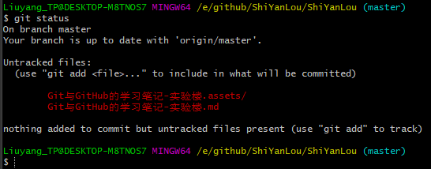

# Git与GitHub的学习笔记-实验楼

## 一、来历等无关紧要的东西

* Linus想要版本控制软件然后就改进了BitKeeper
* 2005年BitKeeper要收回版权，Linus就花10天写了Git
* 2007年三个年轻人觉得Git是个好东西，就搞了个GitHub

## 二、在GitHub上创建仓库

* 创建仓库

  > 

* 注意 （忽略文件、选择所属协议）

  > 
  >
  > 这两项作用之后再讲
  
* Github issue

  > 发现bug，但是目前没有成型代码，需要讨论用，算不算提单？close issue 双方都可以关

* Pull Request

  > fork项目
  >
  > 修改自己仓库的代码
  >
  > 新建pull request
  >
  > 等待作者操作/检查、merge

## 三、安装、升级Git

* git版本查看

  ```shell
  git --version
  ```

* Linux下升级

  ```shell
  sudo apt update  # 更新源
  sudo apt install software-properties-common # 安装 PPA 需要的依赖
  sudo add-apt-repository ppa:git-core/ppa    # 向 PPA 中添加 git 的软件源
  ```

  > linux下升级可能会出错，这时候可能是Python版本问题，可以选择Python3.4：
  >
  > ```shell
  > sudo apt update  # 更新源
  > sudo apt install software-properties-common # 安装 PPA 需要的依赖
  > sudo add-apt-repository ppa:git-core/ppa    # 向 PPA 中添加 git 的软件源
  > ```

  > Windows下安装就直接去官网下载安装好了

## 四、克隆GitHub上的仓库到本地

### 4.1 git clone

* 得到仓库地址：地址栏中复制或者选择Clone or download

  >

* 克隆到本地 git clone

  > 先在到你希望下载到的文件夹中，gitbash here
  >
  > git clone [url]

#### //还有一些其他指令如 -b 之后补充

### 4.2 .git隐藏目录

进入仓库主目录，如下图所示，仓库主目录中有个 `.git` 隐藏目录，它里面包含了仓库的全部信息，**删掉这个目录，仓库就变成普通的目录了**。进入到仓库目录中，命令行前缀发生了一些变化，出现了红色（win是蓝绿色）的 master ，它就是当前所在的分支名：

> 

### 4.3 远程仓信息 git remote -v

克隆一个 GitHub 仓库（也叫远程仓库）到本地，本地仓库则会自动关联到这个远程仓库，执行 `git remote -v` 命令可以**查看本地仓库所关联的远程仓库信息：**

> 

Git 要求对本地仓库关联的每个远程主机都必须指定一个主机名（默认为 origin），用于本地仓库识别自己关联的主机，`git remote` 命令就用于管理本地仓库所关联的主机，一个本地仓库可以关联任意多个主机（即远程仓库）。

### 4.4 初始化个人仓库 git init

它会把当前所在目录变成一个本地仓库，因为有 GitHub 的存在，这个命令在我们的生产生活中用到的次数应该是零，除非你想费时费力自己搭建服务器。其实本地进行版本控制是不是也可以git init下？

### 4.5 配置git信息

/etc/gitconfig	几乎不用	git config --system

~/.gitconfig		常用			git config --gloable

针对特定项目	.git/config文件中	git config --local

> 举例：
>
> git config --local user.name 'Liuyang'
>
> git config --local user.emal 'liuyang.nb@xxx.com'
>
> git config user.name//查看

### 4.6 git checkout

修改了文件text.txt 但是想撤销此次修改：

checkout -- 就是将你之前的修改丢弃掉

> git checkout -- text.txt 这样就真的撤销了，如果没有提交的话

### 4.7 git reset HEAD \<filename>

text.txt 提交到缓存区后，也就是add之后，想要撤销这次add：

> git reset HEAD text.txt

###  4.8 git rm <filename\>

误提交了某文件 test.txt，想要撤销：

> git rm text.txt
>
> git commit -m 'delet text.txt'
>
> //如果突然又不想删除呢？
>
> git  reset HEAD text.txt //恢复为未修改状态
>
> git  checkout -- text.txt //把之前的修改丢弃掉

用系统的指令：

> rm text.txt
>
> //恢复
>
> git checkout -- text.txt


---

---

## 五、Git的基本操作

### 5.1 git仓库三大区域

Git 本地仓库有三大区域：**工作区、暂存区、版本区**。这是一个概念，有这个了解即可，随着使用 Git 的时间增多，慢慢就会理解这三个区域的作用以及为何要这么设计，学习阶段只需按照文档逐步操作即可。接下来我们以命令为主线介绍 Git 的操作。

> 
>
> 

* git工作区

  >添加、编辑、修改文件等操作

* git暂存区

  > 暂存已经修改的文件，最后统一提交到git仓库

* git版本库（Git仓库）

  > 最终确定的文件保存到仓库，成为一个新版本，对他人可见


### 5.1(补) 基本信息设置

> 设置用户名：
>
> git config --global user.name 'liuyang.nb'
>
> 设置用户邮箱
>
> git config --gloable user.name'liuyang.nb@outlook.com'


### 5.2 git status 查看状态

> 
>
> 以上是在工作区进行了修改，也就是有未跟踪的文件/Untracked files

### 5.3 git add 添加到暂存区

* 先 git add test.md

> 

* 撤销暂存操作 git reset -- test.md或者 git rm --cached test,md

  > git reset -- //把暂存区的全部修改撤销

### 5.4 git diff 查看修改详情

现在介绍另一个命令 `git diff`，它可以用来查看工作区被跟踪的文件的修改详情，此时新建文件 one.txt 并未被跟踪，而已被跟踪的文件 README.md 无修改，所以看不到。注意，只有在版本区中存在的文件才是被跟踪文件。

* git diff //diff to add

  > 查看尚未暂存的文件更新了哪些部分，不加参数直接输入
  >
  > **此命令比较的是工作目录(Working tree)和暂存区域快照(index)之间的差异**
  >
  > 也就是修改之后还没有暂存起来的变化内容。
  >
  > 

* git diff --cached/staged        //diff to commit

  > 查看已经暂存起来的文件(staged)和上次提交时的快照之间(HEAD)的差异

* 还有其他的git diff XXX 自己百度

### 5.5删除文件

* 删除文件

  rm test.c

* 从Git中删除

  git rm test.c

* 提交操作

  git commit -m'提交描述'

## 六、简单实战

### 6.1 [基础篇](https://oschina.gitee.io/learn-git-branching/) 

#### 6.1.1 git commit 创建新的提交记录

> 

#### 6.1.2 git branch / git checkout

> git branch bugFix//创建bugFix分支
>
> git checkout bugFix //切换到bugFix分支
>
> 

#### 6.1.3 git merge

* 

  创建新分支：

  git branch bugFix

* 

  切换到新分支，再提交一个版本：

  git checkout bugFix

  git commit

* 

  回到主线，提交一个新版本

  git checkout master

  git commit

* 

  把支线合并到主线上来

  git merge bugFix

* 

  

#### 6.1.4 git rebase

第二种合并分支的方法是 `git rebase`。**Rebase 实际上就是取出==一系列的==提交记录，“复制”它们，然后在另外一个地方逐个的放下去。**

Rebase 的优势就是可以创造更线性的提交历史，这听上去有些难以理解。如果只允许使用 Rebase 的话，代码库的提交历史将会变得异常清晰。

> 
>
> 
>
> git rebase master之后就是bugFix分支复制给master当作下一个分支


### 6.1 高级篇-学习Git分支

#### 6.1.1在提交树上移动 HEAD

HEAD 是一个对**当前检出记录的符号引用** —— 也就是指向你正在其基础上进行工作的提交记录。

HEAD 总是指向当前分支上最近一次提交记录。大多数修改提交树的 Git 命令都是从改变 HEAD 的指向开始的。

HEAD 通常情况下是指向分支名的（如 bugFix）。在你提交时，改变了 bugFix 的状态，这一变化通过 HEAD 变得可见。

**git checkout c4**

> 

分离的HEAD

> 

#### 6.1.2相对引用

**通过指定提交记录哈希值的方式在 Git 中移动不太方便。在实际应用时，并没有像本程序中这么漂亮的可视化提交树供你参考**，所以你就不得不用 `git log` 来查查看提交记录的哈希值。

并且哈希值在真实的 Git 世界中也会更长（译者注：基于 SHA-1，共 40 位）。例如前一关的介绍中的提交记录的哈希值可能是 `fed2da64c0efc5293610bdd892f82a58e8cbc5d8`。舌头都快打结了吧...

比较令人欣慰的是，Git 对哈希的处理很智能。你只需要提供能够唯一标识提交记录的前几个字符即可。因此我可以仅输入`fed2` 而不是上面的一长串字符。

正如我前面所说，通过哈希值指定提交记录很不方便，所以 Git 引入了相对引用。这个就很厉害了!

使用相对引用的话，你就可以从一个易于记忆的地方（比如 `bugFix` 分支或 `HEAD`）开始计算。

相对引用非常给力，这里我介绍两个简单的用法：

- 使用 `^` 向上移动 1 个提交记录
- 使用 `~<num>` 向上移动多个提交记录，如 `~3`

> 
>
> 也可以将HEAD作为相对引用的参照：
>
> git checkout c3
>
> git checkout HEAD^

利用相对引用强制修改分支位置：

> **git branch -f master HEAD~3**
>
> 强制将分支master指向HEAD的上3个节点
>
> 

#### 6.1.3 撤销变更

在 Git 里撤销变更的方法很多。和提交一样，撤销变更由**底层部分**（暂存区的独立文件或者片段）和**上层部分**（变更到底是通过哪种方式被撤销的）组成。我们这个应用主要关注的是后者。

主要有两种方法用来撤销变更 —— 一是 `git reset`，还有就是 `git revert`。接下来咱们逐个进行讲解。

##### git reset

> 

##### git revert

> 

### 6.2移动提交记录

#### 6.2.1整理提交记录

到现在我们已经学习了 Git 的基础知识 —— 提交、分支以及在提交树上移动。 这些概念涵盖了 Git 90% 的功能，同样也足够满足开发者的日常需求

然而, 剩余的 10% 在处理复杂的工作流时(或者当你陷入困惑时）可能就显得尤为重要了。接下来要讨论的这个话题是“整理提交记录” —— **开发人员有时会说“我想要把这个提交放到这里, 那个提交放到刚才那个提交的后面”, 而接下来就讲的就是它的实现方式，非常清晰、灵活，还很生动。**

#### 6.2.2 git cherry-pick

本系列的第一个命令是 `git cherry-pick`, 命令形式为:

- `git cherry-pick <提交号>...`

**如果你想将一些提交复制到当前所在的位置（`HEAD`）下面的话**， Cherry-pick 是最直接的方式了。我个人非常喜欢 `cherry-pick`，因为它特别简单。

> 
>
> 

#### 6.2.3交互式rebase

当你知道你所需要的提交记录（**并且**还知道这些提交记录的哈希值）时, 用 cherry-pick 再好不过了 —— 没有比这更简单的方式了。

但是如果你不清楚你想要的提交记录的哈希值呢? 幸好 Git 帮你想到了这一点, 我们可以利用交互式的 **rebase —— 如果你想从一系列的提交记录中找到想要的记录, 这就是最好的方法了**

交互式 rebase 指的是使用带参数 `--interactive` 的 rebase 命令, 简写为 `-i`

如果你在命令后增加了这个选项, Git 会打开一个 UI 界面并列出将要被复制到目标分支的备选提交记录，它还会显示每个提交记录的哈希值和提交说明，提交说明有助于你理解这个提交进行了哪些更改。

在实际使用时，所谓的 UI 窗口一般会在文本编辑器 —— 如 Vim —— 中打开一个文件。 考虑到课程的初衷，我弄了一个对话框来模拟这些操作。

> 交互式界面我反序了下
>
> 

但是，在实际的操作中是什么样的呢？

### 6.3 杂项

#### 6.3.1 只取一个提交记录 

本地栈式提交：

来看一个在开发中经常会遇到的情况：我正在解决某个特别棘手的 Bug，为了便于调试而在代码中添加了一些调试命令并向控制台打印了一些信息。

这些调试和打印语句都在它们各自的提交记录里。最后我终于找到了造成这个 Bug 的根本原因，解决掉以后觉得沾沾自喜！

最后就差把 `bugFix` 分支里的工作合并回 `master` 分支了。你可以选择通过 fast-forward 快速合并到 `master` 分支上，但这样的话 `master` 分支就会包含我这些调试语句了。你肯定不想这样，应该还有更好的方式……

实际我们**只要让 Git 复制解决问题的那一个提交记录就可以了**。跟之前我们在“整理提交记录”中学到的一样，我们可以使用

- `git rebase -i`
- `git cherry-pick`

来达到目的。

案例：

> 
>
> 只把bugFix的分支合并到主线分支
>
> git checkout master
>
> git cherry-pick c4
>
> 

#### 6.3.2 提交的技巧#1

接下来这种情况也是很常见的：你之前在 `newImage` 分支上进行了一次提交，然后又基于它创建了 `caption` 分支，然后又提交了一次。

**此时你想对的某个以前的提交记录进行一些小小的调整。比如设计师想修改一下 `newImage` 中图片的分辨率，尽管那个提交记录并不是最新的了**

我们可以通过下面的方法来克服困难：

- 先用 `git rebase -i` 将提交重新排序，然后把我们想要修改的提交记录挪到最前
- 然后用 `commit --amend` 来进行一些小修改
- 接着再用 `git rebase -i` 来将他们调回原来的顺序
- 最后我们把 master 移到修改的最前端（用你自己喜欢的方法），就大功告成啦！

当然完成这个任务的方法不止上面提到的一种（我知道你在看 cherry-pick 啦），之后我们会多点关注这些技巧啦，但现在暂时只专注上面这种方法。 最后有必要说明一下目标状态中的那几个`'` —— 我们把这个提交移动了两次，每移动一次会产生一个 `'`；而 C2 上多出来的那个是我们在使用了 amend 参数提交时产生的，所以最终结果就是这样了。

也就是说，我在对比结果的时候只会对比提交树的结构，对于 `'` 的数量上的不同，并不纳入对比范围内。只要你的 `master` 分支结构与目标结构相同，我就算你通过。

> 
>
> git rebase -i HEAD~2
>
> 
>
> git commit --amend
>
> 
>
> git rebase -i HEAD~2
>
> 
>
> git branch -f  master
>
> 

#### 6.3.2 提交的技巧#2

正如你在上一关所见到的，我们可以使用 `rebase -i` 对提交记录进行重新排序。只要把我们想要的提交记录挪到最前端，我们就可以很轻松的用 `--amend` 修改它，然后把它们重新排成我们想要的顺序。

**但这样做就唯一的问题就是要进行两次排序，而这有可能造成由 rebase 而导致的冲突。**下面还是看看 `git cherry-pick`是怎么做的吧。

> 
>
> 


不用rebase完成#1的任务

思路是：把newImage的提交复制一份到主线；修改复制过来的newImage提交；再把caption提交复制过来

> git checkout master
>
> git cherry-pick newImage
>
> git commit --amend
>
> git cherry-pick caption

#### 6.3.3 Git Tags

相信通过前面课程的学习你已经发现了：分支很容易被人为移动，并且当有新的提交时，它也会移动。分支很容易被改变，大部分分支还只是临时的，并且还一直在变。

你可能会问了：**有没有什么可以*永远*指向某个提交记录的标识呢**，比如软件发布新的大版本，或者是修正一些重要的 Bug 或是增加了某些新特性，有没有比分支更好的可以永远指向这些提交的方法呢？

当然有了！Git 的 tag 就是干这个用的啊，它们可以（在某种程度上 —— 因为标签可以被删除后重新在另外一个位置创建同名的标签）永久地将某个特定的提交命名为里程碑，然后就可以像分支一样引用了。

更难得的是，它们并不会随着新的提交而移动。你也不能检出到某个标签上面进行修改提交，它就像是提交树上的一个锚点，标识了某个特定的位置。


> 先看看tag
>
> 
>
> 

小任务：

> 
>
> git tag v0 c1
>
> git tag v1 c2
>
> git checkout v1
>
> 


#### 6.3.4 git describ

由于标签在代码库中起着“锚点”的作用，Git 还为此专门设计了一个命令用来**描述**离你最近的锚点（也就是标签），它就是 `git describe`！

Git Describe 能帮你在提交历史中移动了多次以后找到方向；当你用 `git bisect`（一个查找产生 Bug 的提交记录的指令）找到某个提交记录时，或者是当你坐在你那刚刚度假回来的同事的电脑前时， 可能会用到这个命令。

`git describe` 的语法是：

```
git describe <ref>
```

`<ref>` 可以是任何能被 Git 识别成提交记录的引用，如果你没有指定的话，Git 会以你目前所检出的位置（`HEAD`）。

它输出的结果是这样的：

```
<tag>_<numCommits>_g<hash>
```

`tag` 表示的是离 `ref` **最近的标签**， `numCommits` 是表示这个 `ref` 与 `tag` 相**差有多少个提交记录**， `hash` 表示的是你所给定的 `ref` 所表示的**提交记录哈希值**的前几位。

当 `ref` 提交记录上有某个标签时，则只输出标签名称

### 6.4 高级话题

#### 6.4.1 多分支rebase

哥们儿，我们准备了很多分支！咱们把这些分支 rebase 到 master 上吧。

但是你的领导给你提了点要求 —— 他们希望得到有序的提交历史，也就是我们最终的结果应该是 `C6'` 在 `C7'` 上面， `C5'` 在 `C6'` 上面，依此类推。

任务：

> 
>
> to
>
> 
>
> git rebase master bugFix
>
> git rebase bugFix side
>
> git rebase side another
>
> git rebase another master

#### 6.4.2 选择父节点提交

操作符 `^` 与 `~` 符一样，后面也可以跟一个数字。

但是该操作符后面的数字与 `~` 后面的不同，并不是用来指定向上返回几代，而是指定合并提交记录的某个父提交。还记得前面提到过的一个合并提交有两个父提交吧，所以遇到这样的节点时该选择哪条路径就不是很清晰了。

Git 默认选择合并提交的“第一个”父提交，在操作符 `^` 后跟一个数字可以改变这一默认行为。

> 
>
> 
>
> 
>
> 
>
> 
>
> 
>
> 
>
> 

> 
>
> 从master开始，一句话创建一个分支
>
> git branch bugWork master\^\^2\^
>
> 也可以是
>
> git branch bugWork master\~\^2\^

#### 6.4.3 纠缠不清的分支

现在我们的 `master` 分支是比 `one`、`two` 和 `three` 要多几个提交。出于某种原因，我们需要把 `master` 分支上最近的几次提交做不同的调整后，分别添加到各个的分支上。

`one` 需要重新排序并删除 `C5`，`two` 仅需要重排排序，而 `three` 只需要提交一次。

慢慢来，你会找到答案的 —— 记得通关之后用 `show solution` 看看我们的答案哦。

> 
>
> to
>
> 

my solution:

```shell
git rebase master one//把one分支移动到master
git rebase -i one~4
git rebase master two
git rebase -i two~4
git rebase master~3 three
```

solution:

```shell
git checkout one
git cherry-pick c4 c3 c2
git checkout two
get cherry-pick c5 c4 c3 c2
git branch -f three c2
```


