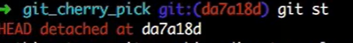

# Git与GitHub的学习笔记-实验楼

## 一、来历等无关紧要的东西

* Linus想要版本控制软件然后就改进了BitKeeper
* 2005年BitKeeper要收回版权，Linus就花10天写了Git
* 2007年三个年轻人觉得Git是个好东西，就搞了个GitHub

## 二、在GitHub上创建仓库

* 创建仓库

  > 

* 注意 （忽略文件、选择所属协议）

  > 
  >
  > 这两项作用之后再讲
  
* Github issue

  > 发现bug，但是目前没有成型代码，需要讨论用，算不算提单？close issue 双方都可以关

* Pull Request

  > fork项目
  >
  > 修改自己仓库的代码
  >
  > 新建pull request
  >
  > 等待作者操作/检查、merge

## 三、安装、升级Git

* git版本查看

  ```shell
  git --version
  ```

* Linux下升级

  ```shell
  sudo apt update  # 更新源
  sudo apt install software-properties-common # 安装 PPA 需要的依赖
  sudo add-apt-repository ppa:git-core/ppa    # 向 PPA 中添加 git 的软件源
  ```

  > linux下升级可能会出错，这时候可能是Python版本问题，可以选择Python3.4：
  >
  > ```shell
  > sudo apt update  # 更新源
  > sudo apt install software-properties-common # 安装 PPA 需要的依赖
  > sudo add-apt-repository ppa:git-core/ppa    # 向 PPA 中添加 git 的软件源
  > ```

  > Windows下安装就直接去官网下载安装好了

## 四、克隆GitHub上的仓库到本地

### 4.1 git clone

* 得到仓库地址：地址栏中复制或者选择Clone or download

  >

* 克隆到本地 git clone

  > 先在到你希望下载到的文件夹中，gitbash here
  >
  > git clone [url]

#### //还有一些其他指令如 -b 之后补充

### 4.2 .git隐藏目录

进入仓库主目录，如下图所示，仓库主目录中有个 `.git` 隐藏目录，它里面包含了仓库的全部信息，**删掉这个目录，仓库就变成普通的目录了**。进入到仓库目录中，命令行前缀发生了一些变化，出现了红色（win是蓝绿色）的 master ，它就是当前所在的分支名：

> 

### 4.3 远程仓信息 git remote -v

克隆一个 GitHub 仓库（也叫远程仓库）到本地，本地仓库则会自动关联到这个远程仓库，执行 `git remote -v` 命令可以**查看本地仓库所关联的远程仓库信息：**

> 

Git 要求对本地仓库关联的每个远程主机都必须指定一个主机名（默认为 origin），用于本地仓库识别自己关联的主机，`git remote` 命令就用于管理本地仓库所关联的主机，一个本地仓库可以关联任意多个主机（即远程仓库）。

### 4.4 初始化个人仓库 git init

它会把当前所在目录变成一个本地仓库，因为有 GitHub 的存在，这个命令在我们的生产生活中用到的次数应该是零，除非你想费时费力自己搭建服务器。其实本地进行版本控制是不是也可以git init下？

### 4.5 配置git信息

/etc/gitconfig	几乎不用	git config --system

~/.gitconfig		常用			git config --gloable

针对特定项目	.git/config文件中	git config --local

> 举例：
>
> git config --local user.name 'Liuyang'
>
> git config --local user.emal 'liuyang.nb@xxx.com'
>
> git config user.name//查看


---

---

## 五、Git的基本操作

### 5.1 git仓库三大区域

Git 本地仓库有三大区域：**工作区、暂存区、版本区**。这是一个概念，有这个了解即可，随着使用 Git 的时间增多，慢慢就会理解这三个区域的作用以及为何要这么设计，学习阶段只需按照文档逐步操作即可。接下来我们以命令为主线介绍 Git 的操作。

> 
>
> 

* git工作区

  >添加、编辑、修改文件等操作

* git暂存区

  > 暂存已经修改的文件，最后统一提交到git仓库

* git版本库（Git仓库）

  > 最终确定的文件保存到仓库，成为一个新版本，对他人可见


### 5.1(补) 基本信息设置

> 设置用户名：
>
> git config --global user.name 'liuyang.nb'
>
> 设置用户邮箱
>
> git config --gloable user.name'liuyang.nb@outlook.com'

### 5.2 git status 查看状态

> 
>
> 以上是在工作区进行了修改，也就是有未跟踪的文件/Untracked files

### 5.3 git add 添加到暂存区

* 先 git add test.md

> 

* 撤销暂存操作 git reset -- test.md或者 git rm --cached test,md

  > git reset -- //把暂存区的全部修改撤销

### 5.4 git diff 查看修改详情

现在介绍另一个命令 `git diff`，它可以用来查看工作区被跟踪的文件的修改详情，此时新建文件 one.txt 并未被跟踪，而已被跟踪的文件 README.md 无修改，所以看不到。注意，只有在版本区中存在的文件才是被跟踪文件。

* git diff //diff to add

  > 查看尚未暂存的文件更新了哪些部分，不加参数直接输入
  >
  > **此命令比较的是工作目录(Working tree)和暂存区域快照(index)之间的差异**
  >
  > 也就是修改之后还没有暂存起来的变化内容。
  >
  > 

* git diff --cached/staged        //diff to commit

  > 查看已经暂存起来的文件(staged)和上次提交时的快照之间(HEAD)的差异

* 还有其他的git diff XXX 自己百度

### 5.5git log

* git log 
* git log  -2 //显示最近提交的2个节点
* git log --pretty=oneline//一行显示的样子
* git log -p//展开每次提交的内容差异
* git log --graph

### 5.6 git checkout --

修改了文件text.txt 但是想撤销此次修改：

checkout -- 就是将你之前的修改丢弃掉

> git checkout -- text.txt 这样就真的撤销了，如果没有提交的话

### 5.7 git reset HEAD \<filename>

text.txt 提交到缓存区后，也就是add之后，想要撤销这次add：

将之前添加到暂存区的内容移除到工作区

> git reset HEAD text.txt

### 5.8 git rm <filename\>

误提交了某文件 test.txt，想要撤销：

> git rm text.txt//==**1删除了一个文件，2同时将删除的文件纳入到stage**==
>
> git commit -m 'delet text.txt'
>
> //如果突然又不想删除呢？
>
> git  reset HEAD text.txt //将文件从暂存区恢复到工作区
>
> git  checkout -- text.txt //将工作区的**修改**丢弃掉

用系统的指令：

> rm text.txt//将文件删掉了，这时被删除的文件并没纳入暂存区
>
> //恢复
>
> git checkout -- text.txt// 注意下，要求之前的text.txt是commited

### 5.9 git mv 重命名/剪切

git mv oldname newname//对比于系统的，就是加上了add操作  

> 

如果是用系统的mv会发生什么？

> 
>
> 删除了老文件，创建了新文件，要自己去add到暂存区

### 5.10git ccommit --amend -m ""

> 上次提交commit -m'这里写错了’；要修改咋么办？
>
> 1、修改下文件test.c 加个空格等不影响程序的操作，在commit；这样笨方法，因为还是会有

## 六、简单实战

### 6.1 [基础篇](https://oschina.gitee.io/learn-git-branching/) 

#### 6.1.1 git commit 创建新的提交记录

> 

#### 6.1.2 git branch / git checkout

> git branch bugFix//创建bugFix分支
>
> git checkout bugFix //切换到bugFix分支
>
> 

#### 6.1.3 git merge

* 

  创建新分支：

  git branch bugFix

* 

  切换到新分支，再提交一个版本：

  git checkout bugFix

  git commit

* 

  回到主线，提交一个新版本

  git checkout master

  git commit

* 

  把支线合并到主线上来

  git merge bugFix

* 

  

#### 6.1.4 git rebase

第二种合并分支的方法是 `git rebase`。**Rebase 实际上就是取出==一系列的==提交记录，“复制”它们，然后在另外一个地方逐个的放下去。**

Rebase 的优势就是可以创造更线性的提交历史，这听上去有些难以理解。如果只允许使用 Rebase 的话，代码库的提交历史将会变得异常清晰。

> 
>
> 
>
> git rebase master之后就是bugFix分支复制给master当作下一个分支


### 6.1 高级篇-学习Git分支

#### 6.1.1在提交树上移动 HEAD

HEAD 是一个对**当前检出记录的符号引用** —— 也就是指向你正在其基础上进行工作的提交记录。

HEAD 总是指向当前分支上最近一次提交记录。大多数修改提交树的 Git 命令都是从改变 HEAD 的指向开始的。

HEAD 通常情况下是指向分支名的（如 bugFix）。在你提交时，改变了 bugFix 的状态，这一变化通过 HEAD 变得可见。

**git checkout c4**

> 

分离的HEAD

> 

#### 6.1.2相对引用

**通过指定提交记录哈希值的方式在 Git 中移动不太方便。在实际应用时，并没有像本程序中这么漂亮的可视化提交树供你参考**，所以你就不得不用 `git log` 来查查看提交记录的哈希值。

并且哈希值在真实的 Git 世界中也会更长（译者注：基于 SHA-1，共 40 位）。例如前一关的介绍中的提交记录的哈希值可能是 `fed2da64c0efc5293610bdd892f82a58e8cbc5d8`。舌头都快打结了吧...

比较令人欣慰的是，Git 对哈希的处理很智能。你只需要提供能够唯一标识提交记录的前几个字符即可。因此我可以仅输入`fed2` 而不是上面的一长串字符。

正如我前面所说，通过哈希值指定提交记录很不方便，所以 Git 引入了相对引用。这个就很厉害了!

使用相对引用的话，你就可以从一个易于记忆的地方（比如 `bugFix` 分支或 `HEAD`）开始计算。

相对引用非常给力，这里我介绍两个简单的用法：

- 使用 `^` 向上移动 1 个提交记录
- 使用 `~<num>` 向上移动多个提交记录，如 `~3`

> 
>
> 也可以将HEAD作为相对引用的参照：
>
> git checkout c3
>
> git checkout HEAD^

利用相对引用强制修改分支位置：

> **git branch -f master HEAD~3**
>
> 强制将分支master指向HEAD的上3个节点
>
> 

#### 6.1.3 撤销变更

在 Git 里撤销变更的方法很多。和提交一样，撤销变更由**底层部分**（暂存区的独立文件或者片段）和**上层部分**（变更到底是通过哪种方式被撤销的）组成。我们这个应用主要关注的是后者。

主要有两种方法用来撤销变更 —— 一是 `git reset`，还有就是 `git revert`。接下来咱们逐个进行讲解。

##### git reset

> 

##### git revert

> 

### 6.2移动提交记录

#### 6.2.1整理提交记录

到现在我们已经学习了 Git 的基础知识 —— 提交、分支以及在提交树上移动。 这些概念涵盖了 Git 90% 的功能，同样也足够满足开发者的日常需求

然而, 剩余的 10% 在处理复杂的工作流时(或者当你陷入困惑时）可能就显得尤为重要了。接下来要讨论的这个话题是“整理提交记录” —— **开发人员有时会说“我想要把这个提交放到这里, 那个提交放到刚才那个提交的后面”, 而接下来就讲的就是它的实现方式，非常清晰、灵活，还很生动。**

#### 6.2.2 git cherry-pick

本系列的第一个命令是 `git cherry-pick`, 命令形式为:

- `git cherry-pick <提交号>...`

**如果你想将一些提交复制到当前所在的位置（`HEAD`）下面的话**， Cherry-pick 是最直接的方式了。我个人非常喜欢 `cherry-pick`，因为它特别简单。

> 
>
> 

#### 6.2.3交互式rebase

当你知道你所需要的提交记录（**并且**还知道这些提交记录的哈希值）时, 用 cherry-pick 再好不过了 —— 没有比这更简单的方式了。

但是如果你不清楚你想要的提交记录的哈希值呢? 幸好 Git 帮你想到了这一点, 我们可以利用交互式的 **rebase —— 如果你想从一系列的提交记录中找到想要的记录, 这就是最好的方法了**

交互式 rebase 指的是使用带参数 `--interactive` 的 rebase 命令, 简写为 `-i`

如果你在命令后增加了这个选项, Git 会打开一个 UI 界面并列出将要被复制到目标分支的备选提交记录，它还会显示每个提交记录的哈希值和提交说明，提交说明有助于你理解这个提交进行了哪些更改。

在实际使用时，所谓的 UI 窗口一般会在文本编辑器 —— 如 Vim —— 中打开一个文件。 考虑到课程的初衷，我弄了一个对话框来模拟这些操作。

> 交互式界面我反序了下
>
> 

但是，在实际的操作中是什么样的呢？

### 6.3 杂项

#### 6.3.1 只取一个提交记录 

本地栈式提交：

来看一个在开发中经常会遇到的情况：我正在解决某个特别棘手的 Bug，为了便于调试而在代码中添加了一些调试命令并向控制台打印了一些信息。

这些调试和打印语句都在它们各自的提交记录里。最后我终于找到了造成这个 Bug 的根本原因，解决掉以后觉得沾沾自喜！

最后就差把 `bugFix` 分支里的工作合并回 `master` 分支了。你可以选择通过 fast-forward 快速合并到 `master` 分支上，但这样的话 `master` 分支就会包含我这些调试语句了。你肯定不想这样，应该还有更好的方式……

实际我们**只要让 Git 复制解决问题的那一个提交记录就可以了**。跟之前我们在“整理提交记录”中学到的一样，我们可以使用

- `git rebase -i`
- `git cherry-pick`

来达到目的。

案例：

> 
>
> 只把bugFix的分支合并到主线分支
>
> git checkout master
>
> git cherry-pick c4
>
> 

#### 6.3.2 提交的技巧#1

接下来这种情况也是很常见的：你之前在 `newImage` 分支上进行了一次提交，然后又基于它创建了 `caption` 分支，然后又提交了一次。

**此时你想对的某个以前的提交记录进行一些小小的调整。比如设计师想修改一下 `newImage` 中图片的分辨率，尽管那个提交记录并不是最新的了**

我们可以通过下面的方法来克服困难：

- 先用 `git rebase -i` 将提交重新排序，然后把我们想要修改的提交记录挪到最前
- 然后用 `commit --amend` 来进行一些小修改
- 接着再用 `git rebase -i` 来将他们调回原来的顺序
- 最后我们把 master 移到修改的最前端（用你自己喜欢的方法），就大功告成啦！

当然完成这个任务的方法不止上面提到的一种（我知道你在看 cherry-pick 啦），之后我们会多点关注这些技巧啦，但现在暂时只专注上面这种方法。 最后有必要说明一下目标状态中的那几个`'` —— 我们把这个提交移动了两次，每移动一次会产生一个 `'`；而 C2 上多出来的那个是我们在使用了 amend 参数提交时产生的，所以最终结果就是这样了。

也就是说，我在对比结果的时候只会对比提交树的结构，对于 `'` 的数量上的不同，并不纳入对比范围内。只要你的 `master` 分支结构与目标结构相同，我就算你通过。

> 
>
> git rebase -i HEAD~2
>
> 
>
> git commit --amend
>
> 
>
> git rebase -i HEAD~2
>
> 
>
> git branch -f  master
>
> 

#### 6.3.2 提交的技巧#2

正如你在上一关所见到的，我们可以使用 `rebase -i` 对提交记录进行重新排序。只要把我们想要的提交记录挪到最前端，我们就可以很轻松的用 `--amend` 修改它，然后把它们重新排成我们想要的顺序。

**但这样做就唯一的问题就是要进行两次排序，而这有可能造成由 rebase 而导致的冲突。**下面还是看看 `git cherry-pick`是怎么做的吧。

> 
>
> 


不用rebase完成#1的任务

思路是：把newImage的提交复制一份到主线；修改复制过来的newImage提交；再把caption提交复制过来

> git checkout master
>
> git cherry-pick newImage
>
> git commit --amend
>
> git cherry-pick caption

#### 6.3.3 Git Tags

相信通过前面课程的学习你已经发现了：分支很容易被人为移动，并且当有新的提交时，它也会移动。分支很容易被改变，大部分分支还只是临时的，并且还一直在变。

你可能会问了：**有没有什么可以*永远*指向某个提交记录的标识呢**，比如软件发布新的大版本，或者是修正一些重要的 Bug 或是增加了某些新特性，有没有比分支更好的可以永远指向这些提交的方法呢？

当然有了！Git 的 tag 就是干这个用的啊，它们可以（在某种程度上 —— 因为标签可以被删除后重新在另外一个位置创建同名的标签）永久地将某个特定的提交命名为里程碑，然后就可以像分支一样引用了。

更难得的是，它们并不会随着新的提交而移动。你也不能检出到某个标签上面进行修改提交，它就像是提交树上的一个锚点，标识了某个特定的位置。


> 先看看tag
>
> 
>
> 

小任务：

> 
>
> git tag v0 c1
>
> git tag v1 c2
>
> git checkout v1
>
> 


#### 6.3.4 git describ

由于标签在代码库中起着“锚点”的作用，Git 还为此专门设计了一个命令用来**描述**离你最近的锚点（也就是标签），它就是 `git describe`！

Git Describe 能帮你在提交历史中移动了多次以后找到方向；当你用 `git bisect`（一个查找产生 Bug 的提交记录的指令）找到某个提交记录时，或者是当你坐在你那刚刚度假回来的同事的电脑前时， 可能会用到这个命令。

`git describe` 的语法是：

```
git describe <ref>
```

`<ref>` 可以是任何能被 Git 识别成提交记录的引用，如果你没有指定的话，Git 会以你目前所检出的位置（`HEAD`）。

它输出的结果是这样的：

```
<tag>_<numCommits>_g<hash>
```

`tag` 表示的是离 `ref` **最近的标签**， `numCommits` 是表示这个 `ref` 与 `tag` 相**差有多少个提交记录**， `hash` 表示的是你所给定的 `ref` 所表示的**提交记录哈希值**的前几位。

当 `ref` 提交记录上有某个标签时，则只输出标签名称

### 6.4 高级话题

#### 6.4.1 多分支rebase

哥们儿，我们准备了很多分支！咱们把这些分支 rebase 到 master 上吧。

但是你的领导给你提了点要求 —— 他们希望得到有序的提交历史，也就是我们最终的结果应该是 `C6'` 在 `C7'` 上面， `C5'` 在 `C6'` 上面，依此类推。

任务：

> 
>
> to
>
> 
>
> git rebase master bugFix
>
> git rebase bugFix side
>
> git rebase side another
>
> git rebase another master

#### 6.4.2 选择父节点提交

操作符 `^` 与 `~` 符一样，后面也可以跟一个数字。

但是该操作符后面的数字与 `~` 后面的不同，并不是用来指定向上返回几代，而是指定合并提交记录的某个父提交。还记得前面提到过的一个合并提交有两个父提交吧，所以遇到这样的节点时该选择哪条路径就不是很清晰了。

Git 默认选择合并提交的“第一个”父提交，在操作符 `^` 后跟一个数字可以改变这一默认行为。

> 
>
> 
>
> 
>
> 
>
> 
>
> 
>
> 
>
> 

> 
>
> 从master开始，一句话创建一个分支
>
> git branch bugWork master\^\^2\^
>
> 也可以是
>
> git branch bugWork master\~\^2\^

#### 6.4.3 纠缠不清的分支

现在我们的 `master` 分支是比 `one`、`two` 和 `three` 要多几个提交。出于某种原因，我们需要把 `master` 分支上最近的几次提交做不同的调整后，分别添加到各个的分支上。

`one` 需要重新排序并删除 `C5`，`two` 仅需要重排排序，而 `three` 只需要提交一次。

慢慢来，你会找到答案的 —— 记得通关之后用 `show solution` 看看我们的答案哦。

> 
>
> to
>
> 

my solution:

```shell
git rebase master one//把one分支移动到master
git rebase -i one~4
git rebase master two
git rebase -i two~4
git rebase master~3 three
```

solution:

```shell
git checkout one
git cherry-pick c4 c3 c2
git checkout two
get cherry-pick c5 c4 c3 c2
git branch -f three c2
```

## 七 .gitignore与分支

### 7.1背景简述

项目分享的时候，除了正常的xxx.c yyy.h文件等和项目相关的文件是希望和别人协作处理的，但是IDE的相关配置文件，dsw之类什么的，或者jdk放置的目录是不同的，这样别人用这些配置文件可能就会出错，这时候，这些非项目相关的文件就不会拿去上传。

### 7.2规则 作用

/mtk 过滤整个文件夹
*.zip 过滤所有.zip文件
/mtk/do.c 过滤某个具体文件
!/mtk/one.txt 追踪（不过滤）某个具体文件

> 注意：如果你创建.gitignore文件之前就push了某一文件，那么即使你在.gitignore文件中写入过滤该文件的规则，该规则也不会起作用，git仍然会对该文件进行版本管理。

### 7.3配置语法

以斜杠“/”开头表示目录；
以星号“*”通配多个字符；
以问号“?”通配单个字符
以方括号“[]”包含单个字符的匹配列表；
以叹号“!”表示不忽略(跟踪)匹配到的文件或目录。

> 注意： git 对于 .gitignore配置文件是按行从上到下进行规则匹配的

/TODO #仅忽略项目目录下的TODO文件，不包括subdir/TODO

mydir/*/test.txt #忽略mydir目录下某目录下的test.txt

mydir/**/test.txt #忽略mydir下所有的目录层次的test.txt

build/ #忽略build/目录下的所有文件

## 八、分支

git branch new_branch

git checkout new_brench

git branch -d new_branch//删除分支,不能是当前所处于的分支，会提醒合并情况

git branch -b new_branch//创建新分支，并且切换到这个分支

git branch -v //所处分支最近的一条提交记录

### 8.1 git merge 合并

```shell
git:(master) git merge new_branch
```

当前分支是master，然后把new_branch合并到maser上。这个时候再删除new_branch就没问题

一条分支的记录情况：

> 

### 8.2 HEAD

* HEAD指向的是当前分支

* master指向提交

  > 
  >
  > git branch dev:
  >
  > 
  >
  > 在dev分支进行一次提交：
  >
  > git commit -m'xxx':
  >
  > 
  >
  > 将dev分支内容合并到master上:
  >
  > 这种合并称为fast forward（快进）
  >
  > 

### 8.3 冲突

master分支和dev分支都有修改，那么是什么状态呢？

> 
>
> 自动合并 test2.txt
>
> 冲突：合并冲突发生在test2.txt
>
> 自动合并失败，修复并且提交结果
>
> vim打开text2.txt,并修改冲突:
>
> 
>
> 然后 git add text2.txt//告诉冲突解决，这里add不是前面的含义
>
> 

### 8.4 分支进阶和版本回退

#### 8.4.1 fast-forward

如果可能，合并分支时Git会使用ff模式；在这种模式下，删除分支会丢掉分支信息

合并时加上 -- no-ff参数会禁用fast-forward，这样会多出一个commit-id

* git merge --no-ff dev

> 

如果没有禁止ff模式：

> git:(master) git merge dev
>
> master分支直接指向了dev的新的提交
>
> 

#### 8.4.2版本回退

* 回退到上一版本

  > git reset -- hard HEAD^
  >
  > git reset --hard HEAD~1
  >
  > git reset --hard commit_id

* 返回到某一版本

  > git reflog//可以看到历史记录的log

回到之前的版本后，要再回到新版本咋办，因为回到老版本后，老版本之后的版本信息都没了的（git log就看不了）

## 九、checkout进阶与stach

### 9.1 checkout -- <filename>:

> 丢弃当前工作空间的修改，使之与上一次（暂存区）内容保持一致。

git checkout 9e7f3

> 切换到commit_id的节点，HEAD是游离状态
>
> 
>
> 虽然切换到了2节点，但是不能在这个节点修改完后再切换到master（4）；你以位是在2修改下，然后切换到4，就保留了新修改的信息，同时3，4 的信息也保留？然而并不是！

咋么办？

> git add .
>
> git commit -m '中途修改了2'
>
> git checkout master
>
> git branch mycommit 5//5这个提交当成一个分支 mycommit

### 9.2 git stach

开发中，你正在开发，但是还没开发完，这时候来了个需求让你在版本2中去开发其他东西，但是这时候的东西由于是还没验证的，不太好commit之后再切换到版本2去开发，这时候就要用到stach

git stach list

git stach pop//恢复同时也将stash内容删除

git stach apply//将之前保存的状态恢复过来，但是不删除保存的那个状态

> 通过 git stach drop stash@{0}手动删除

## 十、标签与diff

### 10.1 tag

> git tag v1.0.1	轻量级标签
>
> git tag -a v1.0.2 -m'xxx'	创建一个带有附注的标签
>
> git tag -d tag_name	删除标签

> git tag	//查看标签
>
> git tag -l 'v1.0'	查找
>
> git tag -l 'v*'	通配查找

### 10.2 diff

#### git blame

> 显示上一次对文件的修改情况，是谁，改了什么

#### 系统 diff:

> 先创建a.md b.md 
>
> a.md:
>
> > hello world
> >
> > hello java
> >
> > hello switch
>
> b.md:
>
> > hello world
> >
> > hello clojure
> >
> > hello python
>
> $ diff -u a.md b.md:
>
> -指源文件	+指目标文件
>
> ```shell
> --- a.md        2019-10-20 11:38:16.155673300 +0800
> +++ b.md        2019-10-20 11:39:25.839049300 +0800
> @@ -1,5 +1,5 @@	//-1行开始，5行
> -hello world
> -
> -hello java
> -
> -hello switch
> \ No newline at end of file
> +hello world
> +
> +hello clojure
> +
> +hello python
> \ No newline at end of file
> 
> ```

#### git diff

##### 1\git diff 工作区&暂存区

修改了某文件之后，先不add，先git diff一下：

```shell
$ git diff a.txt
diff --git a/a.txt b/a.txt
index 831c80f..a44716d 100644
--- a/a.txt	#原始文件---	工作区
+++ b/a.txt	#修改后文件+++	暂存区
@@ -1,3 +1,4 @@
 hello world
 hello java
-hello switch
\ No newline at end of file
+hello switch
+add a new line but not add
```

##### 2\git diff commit_id 工作区&版本区

git diff HEAD <fielname>

> 比较工作区和最新提交(版本区)的差别

##### 3\git diff --cached 暂存区&版本区

git diff --cached commit_id filename

> 比较暂存区和版本去之间的差别

git diff 是只比较比较工作区和暂存区（最后一次add）的区别，git diff --cached 是只比较暂存区和版本库的区别，git diff HEAD -- filename 是只比较工作区和版本库（最后一次commit）的区别。三种比较各对应不同命令的

## 十一、远程与GItHub

pull == fetch + merge 

在GitHub上新建一个仓库后得到该仓库的底座：url_github

在本地git_bash指令输入：

> git remote add origin url_github	//本地将用origin代表那个url

> git push -u origin master	//-u 表示关联，本地master与远程master关联

> 之后会让你输入GitHub的注册名和密码

## 十二、Git远程操作

git remote show	//显示远程仓库，可以有多个远程仓库（显示别名）

* Gitflow

* 基于Git分支的开发模型（一家之言）

  > develop分支（频繁变化的一个分支）
  >
  > test分支（供测试与产品等人员使用，变化不频繁）
  >
  > master分支（生产发布分支，变化非常不频繁）
  >
  > bugfix （生产系统出现紧急bug，用于紧急修复的分支）

远端的网站：https、SSH；对于一般http的是不加密，每次都要输入用户名和密码，比较烦，比较推荐SSH

**需要找到自己主机的公钥传到GitHub上**

公钥私钥可能要再查其他资料去了解

## 十三、Git协作

 其他人修改了push到远端后，自己如果想把修改的push过去是不行的，要先pull过来，再push。

pull过来可能失败，也就是有冲突，要自己解决。

master\==\==origin/master\=\== remote 

**冲突：**

> 有突出后 一方用vim或者其他编辑器处理，看看删除什么留下什么，再调用add（add第三个作用是 标识冲突以及解决掉了）
>
> 再git commit

这部分其实还是要从书本上进行深入的学习会比较好吧

## 十四、Git远程分支、别名

​	【gitk与git gui】

图形界面 本身的 或者 第三方的

> gitk

> git gui


别名：

git config --gloable alias.br branch	//alias.别名	

> st	status
>
> co checkout

git config --gloable alias.unstage reset HEAD	//一个操作

git config --gloable alias.ui '!gitk'	//外部命令

---

### 14.1 本地分支和远程分支同步

远端只有master分支，而本地有master和develop分支，如果本地在develop分支上向远端推送，就会报错。

将本地的新分支推往远端 test=>origin/test;并且在远端新建对于的分支

> git push -u origin test

> git push --set -upstream origin develop	//将本地develop分支推送远端且在远端创建develop分支（同上 test）

其他人协作时候，将李四创建的develop分支pull到本地？

> git pull //	会把远端的所有分支拉取，本地会有新的远程分支，但是没有本地的develop分支（有origin/develop;没有develop分支）
>
> ```shell
> git：（master）git checkout -b develop
> #这里的develop分支是基于master分支创建的；但是我想基于origin/develop分支创建，咋么办？
> ```
>
> ```shell
> git：（master）git checkout -b develop origin/develop
> #这里就是基于origin/develop分支，且与之对应
> 
> git：（master）git checkout --track origin/develop
> #同上（上面的特例，这里没有重新起名字，默认和远程同名）
> ```

### 14.2 远程分支删除

本地有的分支：

```shell
git branch -av
develop
master
test
remote/origin/develop
remote/origin/master
remote/origin/test
```

删除本地分支：

> git branch -d develop	//将本地的develop删除，remote/develop还在
>
> git checkout --track origin/develop	//又创建了

删除远程分支：

> git push origin :develop	//将一个空分支推送到远程的develop也就是删除
>
> git push origin --delete develop//新版本的更直观的方法

重命名远程分支：

> 先删除远程分支，再重新推送
>
> git push origin --delete develop2//先删除远程的develop2
>
> git push --set-upstream origin develop//将本地的develop推上去

说明：如果同名之间push还好说，但是如果不同名要注意了：

> git push origin develop:develop2//将本地的develop推到远端的develop2

## 十五 Git refspec

本地远程分支（远程分支）origin/xxxxx

push的完整操作命令：

> git push origin srcBranch:destBranch//本地：Github

pull的完整操作命令：

> git pull origin srcBranch:destBranch//Github：本地

HEAD标记：

> HEAD文件是一个指向当前所在**分支**的引用标识符，改文件并不包含一个SHA-1值（commit_id)，而是一个指向另外一个引用的指针。

当我们执行git commit命令时，git会创建一个commit对象，并且将这个commit对象的parent指针设置为HEAD所指向引用的SHA-1值。我们对HEAD的所有操作都会被git reflog记录。

### 15.1 远程标签

git tag基础看前面

git push origin tag_name//推送标签

git push origin --tags//将本地还没推送到远端的标签全部推送过去

其他人如何获取标签？

git pull 即可

删除一个远程标签：将空的本地标签堆到远端

git push origin :refs/tags/v6.0	//但是其他pull还是有v6.0

git push origin --delete tag v5.0

## 十六、git远程分支的底层分析

查看远端分支的历史记录：

> git log	//当前分支的log
>
> git log origin/master
>
> git log remotes/origin/master
>
> git log refs/remotes/origin/master

把远端的master分支拉取到本地且对应mymaster：

> git fetch origin master:refs/remotes/origin/mymaster
>
> 本地可能没有对应分支对应，需要一个对应的本地分支
>
> git checkout --track origin/mymaster

## 十七 git gc 垃圾收集

用的很少，了解

> git gc

   把一些东西打包到packed-refs

----

---

---

## 十八、Git裸库与submodule（多模块）

要调用其他项目的Git项目？？？

模拟过程，在GitHub上建立两个项目。（注意SSH-Key的账户添加法)

一个parent项目，一个child项目

在parent项目里面：

> git submodule add url_child	dir/dir是在parent项目中用来放置child项目的文件夹，这个目录要是一个新的目录
>
> 会多出dir文件，和.gitmodule文件夹
>
> 再git add . &git commit -m'add module'

child项目如果发送变化更新，如何在parent更新？

> cd dir	//进入mymodule文件夹
>
> git pull
>
> 项目如果依赖多个submodle难道要进入多个submodle拉取？

> git submodule foreach git pull	//所有的submodule进行拉取

---

如果其他项目组成员要clone你的项目咋办呢，直接clone默认是不会把submodule文件夹克隆下来（会克隆.gitmodule)

> 1. submodule初始化
>
>    git submodule init
>
> 2. 递归更新submodule
>
>    git submodule update --recursive

> 新的方法：
>
> git clone url_被克隆的地址 yourdirname --recursive//加这个参数会克隆子模块

---

如果引入的submodule没用了，如何删除？（没有直接的命令）

> 1 将submodule从缓存区删除
>
> > git rm --cached mymodule
>
> 2 将submodule实体文件从工作区删除
>
> > rm -rf mymodule 
> >
> > git add . & git commit -m'remove submodule'
> >
> > git push
>
> 3 将.gitmodule目录删除
>
> > rm .gitmodules
> >
> > git add . & git commit -m'xxx'
> >
> > git push

## 十九、Git subtree（官方推荐）

面对的目标问题同submodule；但是submodule还是有风险的。有时候主工程里有时候需要修改被依赖工程的代码，还要给推过去，变成双向的了。

首先要有两个工程：git sub tree parent; 	git subtree child

* git remote add subtree-origin url_subtree//添加远程的分支

* git subtree add --prefix=subtree subtree-origin master --squash//将远程被依赖的库(subtree-origin的master分支)放在subtree目录下,--squash可选，把远程的提交合并拉取过来。

  > 现在你的本地master分支会比origin/master领先，需要快进一下

* git push

这时候在child项目添加文件test.txt;然后再parent项目中拉取：

* git subtree pull --prefix=subtree subtree-origin master --squash//这样就把child项目的更新拉取过来，并且由于squash存在，提交记录变成操作者了。
* git push//更新远端（这个只是push到parent项目的远端地址）

---

在parent项目里面修改child项目的文件

* git subtree push --prefix=subtree subtree-origin master

  > 如果被拒绝，可能是当前分支要比远程分支落后，需要先pull？？？视频中这里出错，然后一直找不出原因，就搁置到下一期视频讲解

---

遇到问题，就从头开始复盘：

还是初始化两个项目：parents	child

在本地的parents终端：

* git remote add subtree-origin url_subtree//添加远程的分支

* git subtree add -P subtree subtree-origin master

  > (出错的情况）git subtree add --prefix=subtree subtree-origin master -**-squash**//将远程被依赖的库(subtree-origin的master分支)放在subtree目录下,--squash可选，把远程的提交合并拉取过来。

  > ********************************
  >
  > --squash 会把subtree的多个提交合并成一个提交，这个合并的提交会把原来的commit message合并成一条：
  >
  > 'a' 'b' 'c' ==>'abc'	对于subtree仓库来说是看不到前面三个，只会看到组合后的新的commit_id; 之后的pull还会有新的提交，就是组合的新的commit_id和parents工程合并merge
  >
  > 常规的三分合并：
  >
  > 
  >
  > 然而如果使用--squash：
  >
  > 找不到共同的祖先了。就报错了//可以push到child新建一个分支，再merge到child的master上。但是这样做显得麻烦。//那么是不是不要用--squash？这样就不会有找不到沟通祖先的报错情况，但是这样外层的提交历史（child的）会污染了内层的提交历史（parents的）
  >
  > ---
  >
  > 所以，如果第一条命令（subtree-pull)没有使用--squash，那么之后就要保证都不要使用这个参数；如果一开始使用了，后续所有的都要使用。
  >
  > ---
  >
  > parent里修改后push到child；然后child中pull后再修改，再push；然后parents中再pull；这样出错了，冲突？？？？？

---

Git subtree 深度原理刨析：

从上一节的遗留问题说起，使用squash把subtree-child中拉下来的分支给合并掉了，pull上去合并过程也找不到公共祖先。

----

Git subtree split:

开发好久后，发现某个模块可以单独拿出来当作项目；有两种方法来实现：

* 单独把模块拷贝出来

  > 会丢失提交历史信息

* 利用git subtree split分割 

---

为什么使用和不使用--squash都可能merge时候出错。

问题复述：

> 在child中修改了一个文件，然后将这个文件推送到了远程；再然后再parent中使用了git subtree pull命令，将git subtree中的提交拉取到本地；拉取的时候parents并没有对child中的文件修改过的，本来拉取过来应该是没问题的，但是实际上就是会出现冲突；
>
> 
>
> 分支走下去会发现起始就不是同源

## 二十、Git cherry-pick

说明：将某一个分支的修改运用到另外一个分支上。主要是应用在本地分支上。

加上在develop分支上做了一个模块开发，有两个提交commit_id_1,commit_id_2.现在想把这两个提交移到master分支：

> git checkout master//切换到master分支
>
> git cherry-pick commit_id_1//把commit_id_1应用到master，且生产新的id
>
> git cherry-pick commit_id_2
>
> (develop分支的原有的id_1 id_2还在)
>
> ---
>
> 如果先处理id_2 可能就会出现冲突，出现冲突就和merge的冲突一样取解决就好了
>
> ---
>
> 然后想把develop分支恢复，可以:
>
> > git checkout 合适的提交掉commit_id_0
> >
> > //这时候可以删除develop分支（如果有的话）									git branch -d develop//-D
> >
> > 删除后应该是处于游离状态：
> >
> > 
> >
> > 这时候在这个节点创建分支：
> >
> > git checkout -b develop(不是之前那个)
> >

## 二十一、Git rebase

变基、衍合；rebase的功能类似于merge；为什么出个这个指令？工作方式有显著差异。

回顾merge：

> 
>
> 
>
> 

关于rebase：

> 
>
> 所处mywork分支，以origin为点变基，如5冲突就处理，完事再6；都没冲突就ok。
>
> 
>
> 
>
> 
>
> 把一个分支上的修改应用到另外一个分支上，且会修改提交历史。
>
> 注意事项：
>
> * rebase过程也会出现冲突
> * 解决冲突后，使用git add 添加，然后执行
>   * git rebase --continue
> * 接下来Git会继续应用余下的补丁
> * 任何时候可以git rebase -- abort中止
>
> rebase最佳实践（因为会修改提交历史）：
>
> * **不要对master分支执行rebase，否则会引起很多问题**
> * **一般，执行rebase的分支都是自己的本地分支，没有推送到远程**！

---

Git rebase 实战：


  


 


## 附录：女神的烦恼

**女神：哎呀，刚刚有个地方搞错了，怎么重新来过呢？**

女神莫慌，Git 的牛逼之处，在于它自带时光机效果，能让你在项目的历史代码中任意穿梭。

如果项目的某一处地方它自己不小心坏掉了，不妨试下下面的这行命令：

```text
$ git reflog
```

这条命令能列出你在 Git 上的所有操作记录，你只要找到 HEAD@{index} 前面所对应的操作索引，并使用下面命令即可：

```text
$ git reset HEAD@{index}
```

> 注：使用时需将HEAD@{index}替换为对应索引。


**女神：想改个小东西，但代码不小心提交（commit）了，这可咋整？**

这个简单，首先，添加下当前已改动的代码：

```text
$ git add .
```

然后，运行下面这条命令，它就会把你刚刚添加的代码合并到最后一次提交上了：

```text
$ git commit --amend
```


**女神：哼！刚刚写的提交历史写得不够好，我想重写一下！**

好的，还是上面提到过的那条代码，运行一下，就可以重写提交历史啦：

```text
$ git commit --amend
```


**女神：这下惨了，我刚刚不小心把新分支的代码提交到主分支上了！**

女神别着急，我们一步步来，你先创建个新分支（some-new-branch-name）：

```text
$ git branch some-new-branch-name
```

然后把刚才的提交从主分支中移除：

```text
$ git reset HEAD~ --hard
```

需要注意的是，上面的代码只会切换到最后一条提交记录上，如果你已跑到其它提交记录上怎么办？没关系，你可以用 git reset HEAD@{number} 再跑回来。

等你跑回来之后，我们再切换到新分支上：

```text
$ git checkout some-new-branch-name
```

好了，完成啦，现在主分支干干净净，刚刚不小心提交的代码也被移到新分支上了。

需要注意的是，上面的代码只对本地仓库有效，如果你已经把代码提交到远程仓库上，那就得跟队友商量下解决方案了。

啥？我就是你队友？这可真让我受宠若惊☺️ 不过没事，等下我帮你在线上主分支上 reset 然后 push -f 一下就好啦~


**女神：完蛋了，我把代码提交到错误的分支上了！**

别怕别怕，有我在呢。

我们先撤销最后一次提交，但保留变更代码：

```text
$ git reset HEAD~ --soft
$ git stash
```

再切到你想要提交的正确分支（name-of-the-correct-branch）上，并把变更代码提交上去：

```text
$ git checkout name-of-the-correct-branch
$ git stash pop
$ git add .
$ git commit -m "your message here"
```

OK，到这里就搞定了。

如果想要逼格高点，也可以用 cherry-pick 这个命令来完成上面那些操作。具体的操作步骤如下。

首先，切换到正确的分支上：

```text
$ git checkout name-of-the-correct-branch
```

然后使用 cherry-pick 来获取最新一条提交记录：

```text
$ git cherry-pick master
```

最后再把主分支上那条提交错误的记录删除：

```text
$ git checkout master
$ git reset HEAD~ —-hard
```


**女神：咦？为啥我运行 diff 后啥都没有？**

遇到这种情况，应该是文件没有加入到暂存区的缘故。解决方案很简单，咱们要么把文件加入到暂存区，要么就直接使用下面这条命令：

```text
$ git diff --staged
```

这样，就可以看到未存入暂存区文件的 diff 效果啦。


**女神：这项目怎么这么乱！好烦呐！我不玩了！**

别气别气，别气坏了身子就不好了，么么哒  

如果本地代码仓库把自己折腾得乱七八糟，不用怕，用下面这招，一击必杀：

```text
$ cd ..
$ sudo rm -r fucking-git-repo-dir
$ git clone https://some.github.url/fucking-git-repo-dir.git
$ cd fucking-git-repo-dir
```

是的，这就是备胎（线上仓库）的强大之处，只要你备胎尚在，你就可以大大方方的把本地仓库删了，clone 备胎，从头再来。


**女神：好啦，我没什么问题了，谢谢你哦~**

不不不，这块问题还多着呢？你打开下面这个网站，听我跟你细细道来…